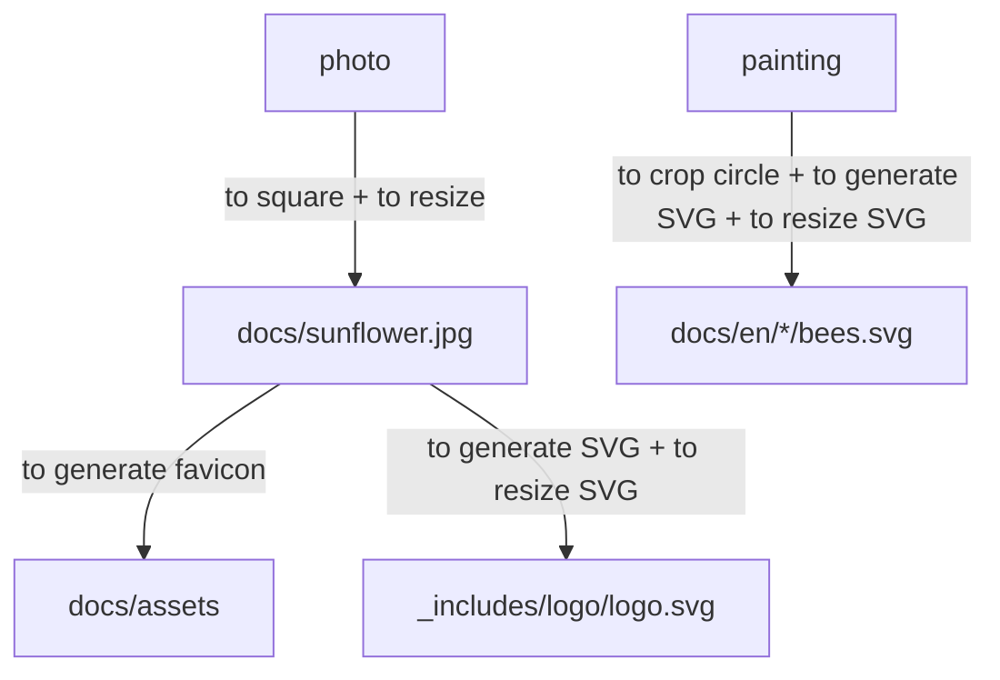

# The jekyll-themed site is up!

The workflow to set up

```
graph TB;
photo --> |to square + to resize| docs/sunflower.jpg --> |to generate favicon| docs/assets
docs/sunflower.jpg --> |to generate SVG + to resize SVG| _includes/logo/logo.svg
painting --> |to crop circle + to generate SVG + to resize SVG| docs/en/*/bees.svg
```



<!--more-->

# NOTES

* 13/12/2022 add-on: Fotor ([https://www.fotor.com/](https://www.fotor.com/)) 

  > a free and great photo editing & graphic design resource that popular among 380 million users from 230 countries.

* Old page: [https://jhz22.user.srcf.net/](https://jhz22.user.srcf.net/)

* Image at work
  * To square, [https://www.oddprints.com/edit](https://www.oddprints.com/edit)
  * To resize JPG, [https://imagemagick.org/index.php](https://imagemagick.org/index.php)

  ```bash
  convert sunflower.jpg -resize 15% sun15.jpg
  ```

* Favicon
  * To generate favicon, [https://realfavicongenerator.net/](https://realfavicongenerator.net/)
* Site logo
  * To generate/resize SVG, [https://inkscape.org/](https://inkscape.org/)
  * To replace logo.svg at assets/image/logo and _includes/svg
* Project icon
  * To crop circle, [https://crop-circle.imageonline.co/](https://crop-circle.imageonline.co/)
  * To generate SVG, [https://inkscape.org/](https://inkscape.org/)
  * To resize SVG (simpler), [https://www.iloveimg.com/resize-image/resize-svg](https://www.iloveimg.com/resize-image/resize-svg)
* Homepage banner
  * To export JPG (1200dpi), [https://www.tracker-software.com/product/pdf-xchange-viewer](https://www.tracker-software.com/product/pdf-xchange-viewer)
  * To crop JPG, mspaint under Windows
  * To generate SVG, [https://convertio.co/jpg-svg/](https://convertio.co/jpg-svg/)
  * To resize SVG (25%), [https://www.iloveimg.com/resize-image/resize-svg](https://www.iloveimg.com/resize-image/resize-svg)

---

```javascript
(() => console.log('Updated!'))();
```
