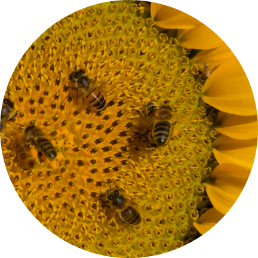

# Mentors/Collaborators

{:.circle}

Beijing University: [Yude Chen](http://finance.sina.com.cn/economist/jingjixueren/20051219/11492209756.shtml) ([School of Public Health](http://sph.pku.edu.cn/))\
Fudan University ([Social Medicine](https://sph.fudan.edu.cn/dept/5)): [Pihuan Jin](https://www.baike.com/wikiid/4250585070644647126?from=wiki_content&prd=innerlink&view_id=3pl79eg77sepds), [Fumin Shen](https://www.baike.com/wikiid/8733105600449106645?view_id=4otxr0qq5u2j9c), [Zhaohuan Zhang](https://baike.baidu.com/item/%E5%BC%A0%E7%85%A7%E5%AF%B0) ([Wiki Entry](http://en.wikipedia.org/wiki/Zhang_Zhaohuan))\
Havard School of Public Health: [David Christiani](https://www.hsph.harvard.edu/david-christiani/), [William Hsiao](http://www.hsph.harvard.edu/william-hsiao/) ([Wiki Entry](http://en.wikipedia.org/wiki/William_Hsiao)), [Nan Laird](http://www.hsph.harvard.edu/nan-laird/) ([Wiki Entry](http://en.wikipedia.org/wiki/Nan_Laird))\
Kings College London: [David Collier](https://kclpure.kcl.ac.uk/portal/david.collier.html), [Tao Li](https://kclpure.kcl.ac.uk/portal/en/persons/tao-li(279830ab-410a-4150-a30a-e3a56dad93aa).html), [Peter McGuffin](https://www.kcl.ac.uk/ioppn/depts/sgdp-centre/about/history/mcguffintribute.aspx) ([Wiki Entry](https://en.wikipedia.org/wiki/Peter_McGuffin)), [Robin Murrary](https://kclpure.kcl.ac.uk/portal/en/persons/robin-murray(0875bc32-9bb1-47b3-90c2-5783969e5ce5)/biography.html) ([Wiki Entry](https://en.wikipedia.org/wiki/Robin_Murray))\
Max Planck-CAS Paul Gerson Unna Research Group on Dermatogenomics: [Sijia Wang](http://www.picb.ac.cn/picb-dynamic/dermatogenomics/index.jsp?ntype=3)\
National Institute of Health: [Abbas Parsian](https://www.niaaa.nih.gov/dnb)\
Shandong University: [Biostatistics](http://biostat.sdu.edu.cn/)\
University College London: [Steve Humphries](https://www.ucl.ac.uk/cardiovascular/cardiovascular-genetics), [Michael Marmot](http://iris.ucl.ac.uk/iris/browse/profile?upi=MGMAR64)([Wiki Entry](http://en.wikipedia.org/wiki/Michael_Marmot)), [Andres Ruiz-Linares](https://www.ucl.ac.uk/biosciences/gee/human-population-genetics), [Arron Hingorani](https://www.ucl.ac.uk/biosciences/people/prof-aroon-hingorani), [Stephen Senn](http://www.senns.uk/)\
University of Cambridge: [Nicholas J. Wareham](https://research.com/u/nicholas-j-wareham), [Jian'an Luan](https://research.com/u/jianan-luan)\
University of Hong Kong: [Pak Sham](https://www.psychiatry.hku.hk/prof-pak-sham)\
University of Illinois at Chicago: [Xiping Xu](http://www.uic.edu/sph/epi-bio/faculty-and-staff)\
University of Southern Denmark: [Qihua Tan](http://www.sdu.dk/staff/qtan.aspx)
