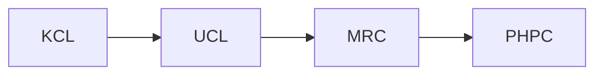

# Resource

## Work-related

## Featured articles

+ [Does eating processed and red meat cause cancer?](https://www.cancerresearchuk.org/about-cancer/causes-of-cancer/diet-and-cancer/does-eating-processed-and-red-meat-cause-cancer)
+ [Effects of Alcohol - Cancer](https://alcoholrehabhelp.org/addiction/effects/cancer/)
+ [Is Parkinson’s Genetic?](https://knowyourdna.com/parkinsons-genetic/)
+ [Ozempic (semaglutide)](https://www.drugwatch.com/drugs/ozempic/) and [side effects](https://www.drugwatch.com/drugs/ozempic/side-effects/) from [DrugWatch](https://www.drugwatch.com/)
+ [What is The Connection Between Depression and Drug Addiction?](https://www.southjerseyrecovery.com/treatment-programs/dual-diagnosis/depression/)

## General information

* Fake Fragrances, <https://fakefragrances.com/>
+ Know your DNA, Know your History, <https://knowyourdna.com/>

## Drug and substance abuse

* 449 Recovery, <https://449recovery.org/>
- Acquare Recovery, <https://www.acquarecovery.com/>
* Addiction Resources in Northern Illinois, <https://www.northernillinoisrecovery.com/resources/>
- Alcohol Rehab Help, <https://alcoholrehabhelp.org/>
- Ambrosia Treatment Center, <https://www.ambrosiatc.com/>
* Amethyst Recovery DeTox, <https://www.amethystrecovery.org/>
* AToN Center, <https://www.atoncenter.com/>
* Bayview Recovery Center, <https://www.bayviewrecovery.com/>
+ Blue Star Recovery, <https://bluestarrecovery.com/>
- Casco Bay Recovery, The Leading Addiction Treatment Center for Portland, Maine, <https://cascobayrecovery.com/>
* Crestview Recovery, <https://www.crestviewrecovery.com/>
* Denoon Recovery Center, <https://www.denoonrecovery.com/>
* Discovery Institute, <https://www.discoverynj.org/>
* Drug and Alcohol Addiction Treatment Services, <https://addiction-treatment-services.com/>
* Eagle Creek Ranch Recovery, <https://idahorecoverycenter.com/>
- First City Recovery Center, <https://firstcityrecoverycenter.com/programs/>
- FreebytheSea Sunset View Drug & Alcohol Recovery Center, <https://freebythesea.com>
- Golden Gate Recovery, <https://goldengaterecovery.com/>
- Immersive Recovery, <https://immersiverecovery.com/>
* IOP Addiction Treatment for Men, <https://www.recoverintegrity.com/>
* Jay Walker Lodge, <https://jaywalkerlodge.com/>
- Laguna Shores Recovery, <https://lagunashoresrecovery.com/>
* Legends Recovery Center LLC, <https://legendsrecovery.com/>
* Live Free Recovery Services -- Drug Rehab Program,  <https://livefreerecoverynh.com/programs/>
- Magnolia City Detox, <https://magnoliacitydetox.com/programs/>
* Massachusetts Addiction Treatment Center, <https://advancedaddictioncenter.com/>
* Moving Mountains Recovery, <https://movingmountainsrecovery.com/>
* MPower Wellness Exton, <https://mpowerwellness.com/>
* Orlando Treatment Solutions, <https://orlandotreatmentsolutions.com/>
+ Path To Recovery Detox, <https://pathtorecoverydetox.com/>
* Sana Lake Recovery Behavioral Wellness Center, <https://sanalake.com/service-areas/maryland-heights/>
- Santa Barbara Recovery, <https://santabarbararecovery.com/>
* Smoke free UK, <https://smokefreeuk.co.uk/>
- Spero Recovery, <https://www.sperorecovery.org/>
* The Freedom Center, <https://www.thefreedomcenter.com/>
+ The Recovery Village Cherry Hill at Cooper, <https://www.southjerseyrecovery.com/>
* The Villa Kali Ma holistic addiction and mental health recovery centers, <https://villakalima.com/>
- True Life Recovery, <https://trueliferecovery.com/>
* Westwind Behavioral Health Treatment, <https://www.westwindrecovery.com/>
* Wisconsin Recovery Institute, <https://wisconsinrecoveryinstitute.com/resources/>

## Physical, mental and behavioral Health

* Adler Health, <https://adlerhealth.com/>
* Elevated Wellness Clinic, <https://elevatedwellnessclinic.com/>
* Evolve Wellness, <https://www.evolvewellnessinc.com/>
* Innercept, <https://www.innercept.com/>
* Ironwood Maine, <https://www.ironwoodmaine.com/>
* Lightwork Therapy & Recovery, <https://lightworktr.com/>
* Mental Health Speak, <https://mentalhealthpeak.com/>
* Monroe Street Housing, <https://monroestreetsoberliving.com/>
* Paradigm Treatment, <https://paradigmtreatment.com/>
* Shortridge Academcy, <https://www.shortridgeacademy.com>
* Taste Recovery, <https://www.tasterecovery.com/>
+ The Ridge, <https://theridgertc.com/>
* Tusk Kratom, <https://tuskkratom.com/>
* West Valley Detox, <https://westvalleydetox.com/>

## Social care

* Shepherd Premier Senior Living, <https://shepherdpremierseniorliving.com/>

---

## Contributors

- Dominique Legget, <dominique.legget@thedigitalintellect.com>
- Eliza Hadley, <eliza.hadley@gv.alcoholrehabhelp.org>
- Emma Tressler, <healthcare@thedigitalintellect.com>
- Enmanuel Batista <ebatista@drugwatch.com>
- Mara Davis <mara@hr.knowyourdna.com>
- Nomhle Mcunu <nmcunu@southjerseyrecoverypr.com>
- Rachel Parker, <iamrachelparker@gmail.com>

***Created on** 12/1/2023 and **last changed** 9/1/2024*
