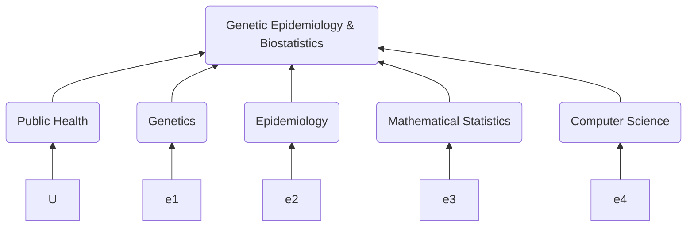

I have promoted reproducible research through curation and software implementation, presentations and data-driven projects. It is encouraging and awarding to receive your [e-mail](mailto:jinghuazhao@hotmail.com) with comments or information on citations (as [early collections](references.txt) from Google search and Google Scholar on [R/gap](https://tinyurl.com/yxh3ycwg)).

{:.circle}

## Bookmarks

 [software collections](r-genetics.md), web site collections at
 [DPHPC](dphpclinks.md),
 [MRC](mrclinks.md) with [comments](mrc/comments.txt),
 [UCL](ucllinks.md) with [comments](ucl/comments.txt),
 [KCL](kcllinks.md) with [comments](iop/comments.txt) and a [graphviz](assets/images/grViz.png) diagram from [grViz.gv](assets/images/grViz.gv) and mermaid.

## Presentations

 [useR!2007](http://www.user2007.org/),
 [useR!2008](http://www.statistik.uni-dortmund.de/useR-2008/tutorials/),
 [useR!2009](http://www.r-project.org/conferences/useR-2009/tutorials/index.html),
 [useR!2010](http://www.r-project.org/conferences/useR-2010/tutorials/index.html),
 [useR!2011](https://www.r-project.org/conferences/useR-2011/),
 [GWAS course](https://jinghuazhao.github.io/GWAS-course/), 
 Henry-Stewart and local talks.

## Projects

 [consortium](https://jinghuazhao.github.io/en/consortium) work,
 [other](https://jinghuazhao.github.io/en/others) projects,
 [cambridge-ceu](https://cambridge-ceu.github.io/) GitHub organisation.
